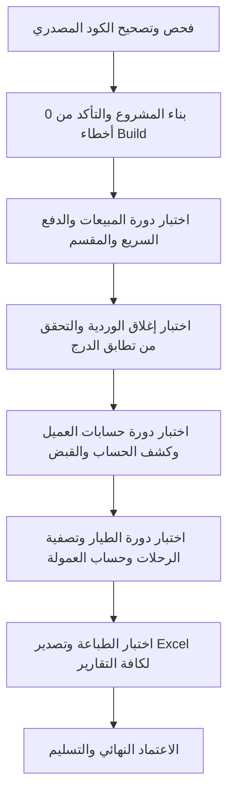

# خطة العمل الشاملة لتطوير وإصلاح منظومة المبيعات والورديات والعملاء والطيارين والتقارير
## مشروع: Sestamk.VB (نظام إدارة نقاط البيع والمطاعم)
**تاريخ التوثيق:** 2026-09-26  
**الإصدار المستهدف:** V1.2 - Production Fix & Enhancements

---

## الفهرس العام للخطة
1. [ملخص الوضع الحالي والفجوات الهيكلية](#1-ملخص-الوضع-الحالي-والفجوات-الهيكلية)
2. [المرحلة الأولى: الإصلاحات الحرجة والفورية (Critical Fixes & Zero-Tolerance Bugs)](#2-المرحلة-الأولى-الإصلاحات-الحرجة-والفورية)
3. [المرحلة الثانية: التكامل المالي والمحاسبي الدقيق (Financial & Accounting Integrations)](#3-المرحلة-الثانية-التكامل-المالي-والمحاسبي-الدقيق)
4. [المرحلة الثالثة: ربط الواجهات وتحسين تجربة المستخدم (UI/UX & Workflow Linkage)](#4-المرحلة-الثالثة-ربط-الواجهات-وتحسين-تجربة-المستخدم)
5. [المرحلة الرابعة: التقارير والطباعة والتصدير (Reporting, Printing & Exports)](#5-المرحلة-الرابعة-التقارير-والطباعة-والتصدير)
6. [المرحلة الخامسة: بروتوكول الاختبار والتحقق الشامل (Testing & Verification Protocol)](#6-المرحلة-الخامسة-بروتوكول-الاختبار-والتحقق-الشامل)
7. [جدول المهام ومصفوفة المسؤوليات](#7-جدول-المهام-ومصفوفة-المسؤوليات)

---

## 1. ملخص الوضع الحالي والفجوات الهيكلية

### الفجوة الأساسية (Dual Architecture Gap)
يحتوي النظام على مسارين متداخلين لإدارة البيانات:
- **المسار الحديث (Restaurant POS Engine):**
  - الجداول: `SalesInvoices`, `SalesInvoiceDetails`, `Shifts`, `CustomerTransactions`, `DriverTransactions`.
  - محرك البيانات: `POSRepository.vb`.
  - الشاشات: `frmPOS`, `FrmCustomers`, `FrmCustomerStatement`, `FrmShiftReports`, `FrmDriverReport`, `FrmSalesReport`.
- **المسار القديم (Legacy Retail Engine):**
  - الجداول: `SalesHeader`, `SalesDetails`, `Customer_TBL`, `CustomerBalanceLog`.
  - محرك البيانات: `ReportsModule.vb`.
  - الشاشات: `Reports.vb`, `Customer.vb`, `Sales_Returns.vb`.

**الهدف من الخطة:** توحيد جميع العمليات لتعمل على المحرك الحديث `POSRepository` وتصحيح العيوب الحسابية والبرمجية دون كسر التوافق.

---

## 2. المرحلة الأولى: الإصلاحات الحرجة والفورية

### 1.1 تصحيح خطأ انهيار شاشة الطيارين (SQL Syntax Error Crash)
- **الملف المتأثر:** `WindowsApp1/frmDeliveryDrivers.vb`
- **الموقع:** الأسطر 234 - 235 (`btnEdit_Click`)
- **السبب الجذري:** نسيان فاصلة (`,`) بين بارامتر المنطقة والملاحظات:
  ```vb
  ' الخطأ الحالي:
  "VehiclePlateNumber=@PlateNumber, IsPercentage=@IsPercentage, DeliveryFeeValue=@FeeValue,AreaID=@AreaID Notes=@Notes, IsActive=@IsActive WHERE DriverID=@DriverID"
  ```
- **الإجراء المطلوب:**
  - تعديل السطر لإضافة الفاصلة: `, AreaID=@AreaID, Notes=@Notes,`
  - التأكد من قراءة وتحديث الحقل `Phone2` كذلك.

### 1.2 تصحيح الكارثة الحسابية في مرتجع المبيعات (Double Debt Bug)
- **الملف المتأثر:** `WindowsApp1/Sales_Returns.vb`
- **الموقع:** الأسطر 1699 - 1703 والأسطر 1770 - 1772 والسطر 1850
- **السبب الجذري:**
  - النظام يعتمد أن الرصيد السالب (`-`) يمثل مديونية على العميل (دين).
  - عند إرجاع صنف آجل، يتم استدعاء: `UpdateCustomerBalance(CustomerCode, -creditRefund, transaction)`
  - والدالة تنفذ: `CurrentBalance = ISNULL(CurrentBalance,0) + @Amount`
  - إضافة قيمة سالبة لرصيد سالب يجعل الدين أكبر، فيتم محاسبة العميل مرتين بدلاً من تخفيض دينه!
  - بالإضافة لقلب قيمتي `Total_Amount` و `Net_Amount` في رأس الفاتورة.
- **الإجراء المطلوب:**
  - تعديل القيمة الممررة لتكون بالموجب `+creditRefund` لتخفيض المديونية باتجاه الصفر.
  - إدراج حركة دائنة في جدول `CustomerTransactions` (TransactionType = 'مرتجع مبيعات', Credit = creditRefund, Debit = 0).
  - تصحيح بارامترات `@Total_Amount = totalBeforeDiscount` و `@Net_Amount = totalAfterDiscount`.

### 1.3 معالجة عدم مزامنة جلسة الوردية في الذاكرة (ShiftSession Cache Desync)
- **الملف المتأثر:** `WindowsApp1/frmShifts.vb`
- **الموقع:** الأسطر 353 (فتح الوردية) والأسطر 420 - 435 (إغلاق الوردية)
- **السبب الجذري:**
  - عند إغلاق الوردية (`btnCloseShift_Click`)، يتم تحديث الداتا بيز فقط دون استدعاء `ShiftSession.ClearSession()`.
  - تظل الجلسة بالذاكرة بحالة `Status = 1`، مما يسمح باستمرار البيع على الوردية المغلقة.
  - عند فتح وردية جديدة (`btnOpenShift_Click`) لا يتم استدعاء `InitializeShiftSession()`.
- **الإجراء المطلوب:**
  - استدعاء `ShiftSession.ClearSession()` فور نجاح عملية الإغلاق.
  - استدعاء `InitializeShiftSession()` فور نجاح فتح الوردية وتحديث تسمية الواجهة.

### 1.4 ربط سندات قبض العملاء بكشف الحساب (Missing Ledger Transactions)
- **الملف المتأثر:** `WindowsApp1/frmConfirmMessage.vb` و `WindowsApp1/Customer_Balance_Download.vb`
- **الموقع:** الأسطر 88 - 146 في `frmConfirmMessage.vb`
- **السبب الجذري:**
  - حفظ السداد يتم في جدول `CustomerBalanceLog` فقط، ولا يتم إدراج صف في `CustomerTransactions`.
  - كشف الحساب `FrmCustomerStatement` يقرأ من `CustomerTransactions` فقط، فتختفي سندات القبض تماماً من كشف الحساب!
  - يتم تمرير `CustomerID` و `CustomerCode` كنصوص فارغة `""` ويتم التحديث بالاسم.
- **الإجراء المطلوب:**
  - جلب `CustomerID` و `CustomerCode` بدقة وتمريرهما للنموذج.
  - إضافة استعلام `INSERT INTO CustomerTransactions` داخل المعاملة (Transaction):
    - `TransactionType = N'سند قبض / سداد نقدي'`
    - `Debit = 0`, `Credit = pay`
    - `BalanceAfter = newB`
  - ربط السداد بالخزينة وبالوردية الحالية (`TotalIncomes`).

### 1.5 تصحيح ضياع إيرادات الفواتير المقسمة (Split Bill Treasury Bypass)
- **الملف المتأثر:** `WindowsApp1/frmPOS.vb`
- **الموقع:** السطر 2153 (`OpenSplitBill`)
- **السبب الجذري:** إنشاء الفاتورة بدون تعيين `TreasuryID`، مما يعطل استدعاء `TreasuryService.AddTransactionAsync` فلا تُقيد المبالغ في الخزينة.
- **الإجراء المطلوب:**
  - إسناد الخزينة الافتراضية للفاتورة:
    ```vb
    Dim defTreasury = SettingsManager.GetIntSetting(SettingsKeys.DefaultTreasuryID, 1)
    invoice.TreasuryID = If(defTreasury > 0, defTreasury, 1)
    ```

### 1.6 ربط المصروفات النثرية بالوردية النشطة (Cash Register Shortage Fix)
- **الملف المتأثر:** `WindowsApp1/form_Expenses.vb`
- **الموقع:** السطر 114 وما بعده
- **السبب الجذري:** حفظ المصروف لا يسجل `ShiftID` ولا يحدث `Shifts.TotalExpenses`، مما يسبب عجزاً وهمياً مساوياً للمصروفات عند جرد الدرج.
- **الإجراء المطلوب:**
  - فحص وجود وردية نشطة وإرفاق `ShiftID` في جدول `Expenses`.
  - تنفيذ تحديث متزامن:
    ```sql
    UPDATE Shifts SET TotalExpenses = ISNULL(TotalExpenses, 0) + @Amount WHERE ShiftID = @ShiftID;
    ```

---

## 3. المرحلة الثانية: التكامل المالي والمحاسبي الدقيق

### 2.1 معالجة عمولة طياري الدليفري ومنع عجز الكاشير
- **الملفات المتأثرة:** `WindowsApp1/classes/POSRepository.vb`, `WindowsApp1/forms/FrmDriverReport.vb`
- **التحليل المحاسبي:**
  - الفاتورة تُحصَّل بالكامل متضمنة رسوم التوصيل، وتدخل الخزينة بالكامل.
  - الطيار يقتطع عمولته ويسلم الكاشير الصافي.
  - غياب قيد صرف لعمولة الطيار يترك عجزاً مساوياً للعمولة في الدرج.
- **الإجراء المطلوب:**
  - عند تنفيذ التصفية (`SettleDriverOrders`):
    1. قيد صرف عمولة من الخزينة: نوع الحركة = `صرف عمولة توصيل طيار`.
    2. تحديث حركة الوردية لتسجيل صرف العمولة من الدرج.

### 2.2 دعم الدفع الإلكتروني (Visa / Network / Wallet)
- **الملفات المتأثرة:** `WindowsApp1/forms/FrmQuickPayment.vb`, `WindowsApp1/classes/POSRepository.vb`, `WindowsApp1/moduls/InvoiceModel.vb`
- **الإجراء المطلوب:**
  - إضافة خيار دفع ثالث بالواجهة: `rdoVisa` (بطاقة بنكية / فيزا).
  - إضافة حقل `PaymentType As String` إلى كائن `InvoiceModel` وحفظه في جدول `SalesInvoices`.
  - إذا كان الدفع فيزا: تحديث حقل `TotalVisaSales` في جدول `Shifts`، وعدم إضافة المبلغ إلى كاش الدرج المتوقع لمنع العجز.

### 2.3 الرصيد الافتتاحي في كشف حساب العميل (Opening Balance Prior to Date)
- **الملف المتأثر:** `WindowsApp1/forms/FrmCustomerStatement.vb` و `WindowsApp1/classes/POSRepository.vb`
- **الإجراء المطلوب:**
  - تعديل دالة `GetCustomerStatement` لحساب رصيد ما قبل الفترة:
    ```sql
    SELECT ISNULL(SUM(Credit - Debit), 0) FROM CustomerTransactions 
    WHERE CustomerID = @CID AND TransactionDate < @FromDate;
    ```
  - إظهار صف تمهيدي في أول الجدول بعنوان `رصيد ما قبل الفترة / رصيد افتتاحي`.

---

## 4. المرحلة الثالثة: ربط الواجهات وتحسين تجربة المستخدم

### 3.1 ربط الشاشات في الشاشة الرئيسية `MainForm`
- **الملف المتأثر:** `WindowsApp1/MainForm.vb` و `MainForm.Designer.vb`
- **الإجراء المطلوب:**
  - إضافة زر صريح لشاشة تنزيل رصيد العميل / سند القبض (`Customer_Balance_Download`) في شريط أدوات العملاء `ToolStrip2`.
  - توجيه زر `ToolStripButton11` ("تقارير العملاء") ليفتح شاشة كشف الحساب الحديثة `FrmCustomerStatement` أو تقارير مبيعات العملاء الحديثة بدلاً من الشاشة الموروثة `Reports.vb`.

### 3.2 إتاحة البيع الآجل وحد الائتمان في دليل العملاء `FrmCustomers`
- **الملف المتأثر:** `WindowsApp1/FrmCustomers.vb`
- **الإجراء المطلوب:**
  - ربط حقل حد الائتمان `CreditLimit` وخاصية السماح بالآجل `AllowCredit` في الحفظ والتعديل، وتفعيل `AllowCredit = True` افتراضياً للعملاء المسجلين.
  - إرجاع `DialogResult.OK` عند الحفظ الناجح لتحديث قائمة الاختيار `FrmSelectCustomer` تلقائياً.

### 3.3 تحسين سرعة الكاشير في الدفع السريع `FrmQuickPayment`
- تفعيل `KeyPreview = True`.
- برمجة حدث `KeyDown`:
  - `Enter` -> تنفيذ `btnConfirm.PerformClick()` للتأكيد الفوري بدون فأرة.
  - `Escape` -> إلغاء الدفع والعودة لشاشة الأصناف.

---

## 5. المرحلة الرابعة: التقارير والطباعة والتصدير

### 4.1 تقرير المبيعات الشامل `FrmSalesReport`
- إضافة زر طباعة التقرير بصيغة A4 منسقة.
- إضافة زر تصدير البيانات إلى Excel عبر `ClosedXML`.
- تفعيل النقر المزدوج على الفاتورة لعرض قائمة الأصناف المبيعة والإضافات.
- إضافة فلترة إضافية حسب الكاشير والطيار وطريقة الدفع.

### 4.2 تقرير الورديات `FrmShiftReports`
- إزالة قيد الـ 25 صفاً في الطباعة الورقية وبرمجة الترقيم التلقائي للصفحات المتعددة (Pagination).
- تصحيح حقل هاتف العميل ليقرأ `ISNULL(C.Phone1, ISNULL(C.PhoneNumber, '-'))`.

### 4.3 تقرير الطيارين `FrmDriverReport`
- إضافة زر طباعة ملخص حسابات الطيار لتسليم نسخة ورقية له عند التصفية.
- إضافة زر التصدير إلى Excel.

---

## 6. المرحلة الخامسة: بروتوكول الاختبار والتحقق الشامل



### معايير القبول (Acceptance Criteria):
1. عدم وجود أي خطأ استعلام SQL عند تعديل الطيارين أو حفظ المرتجعات.
2. تطابق كاش الدرج الفعلي مع الكاش المفترض للوردية دون أي عجز وهمي ناتج عن مصروفات أو عمولات طيارين.
3. ظهور أي سند قبض عميل فوراً في كشف حسابه برقم وتاريخ واضحين.
4. تخفيض مديونية العميل عند عمل مرتجع مبيعات دون مضاعفة الرصيد.
5. استمرار بناء المشروع وتجميعه بصيغة `Debug/Release` دون أي تحذيرات حرجة أو أخطاء كومبايل.

---

## 7. جدول المهام ومصفوفة المسؤوليات

| الرقم | المهمة | الملف الرئيسي | الأولوية | الحالة المقدرة |
|:---:|---|---|:---:|:---:|
| **1** | تصحيح خطأ بناء جملة SQL لتعديل الطيار | `frmDeliveryDrivers.vb` | قصوى | جاهز للتطبيق |
| **2** | تصحيح إشارة مديونية مرتجع المبيعات وعكس الإجمالي/الصافي | `Sales_Returns.vb` | قصوى | جاهز للتطبيق |
| **3** | إصلاح تفريغ وتحميل كاش الوردية في الذاكرة | `frmShifts.vb` | قصوى | جاهز للتطبيق |
| **4** | قيد سندات القبض في جدول حركات العملاء والربط بالـ ID | `frmConfirmMessage.vb` | قصوى | جاهز للتطبيق |
| **5** | ربط الفواتير المقسمة بالخزينة لضمان توريد الإيرادات | `frmPOS.vb` | قصوى | جاهز للتطبيق |
| **6** | ربط المصروفات التشغيلية بالوردية لمنع عجز الدرج | `form_Expenses.vb` | عالية | جاهز للتطبيق |
| **7** | معالجة عمولة التوصيل في تسوية الطيار محاسبياً | `POSRepository.vb` / `FrmDriverReport.vb` | عالية | جاهز للتطبيق |
| **8** | دعم الدفع بالفيزا وتسجيلها بتقرير الوردية | `FrmQuickPayment.vb` | عالية | جاهز للتطبيق |
| **9** | الرصيد الافتتاحي ما قبل الفترة بكشف حساب العميل | `FrmCustomerStatement.vb` | عالية | جاهز للتطبيق |
| **10** | ربط شاشات السداد وتقارير العملاء الحديثة بالقائمة الرئيسية | `MainForm.vb` | متوسطة | جاهز للتطبيق |
| **11** | الطباعة متعددة الصفحات وتصدير الإكسيل للتقارير | `FrmShiftReports.vb` / `FrmSalesReport.vb` | متوسطة | جاهز للتطبيق |
